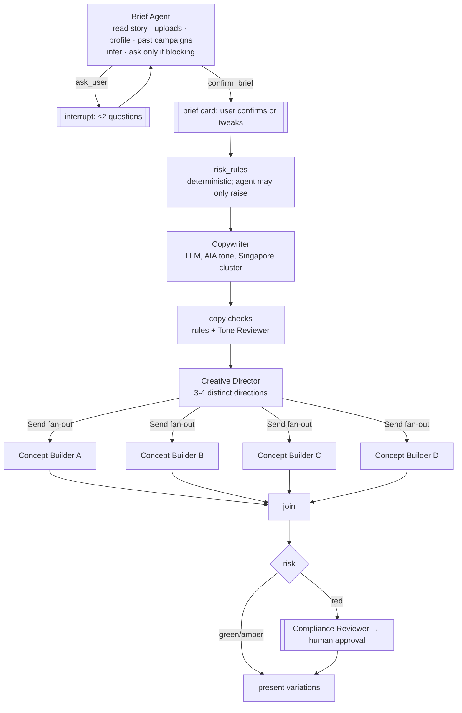

# AIA Agent Marketing Studio: Architecture and Delivery Plan

Status: draft v0.2 (2026-09-19): adds Brief Agent, agent catalogue, cost and token governance

> **This is the TARGET architecture** (web workspace, LangGraph, approvals) and the framework
> decision record. For what is actually built today, see `docs/architecture.md`. · Input: `AIA_Agent_Marketing_Studio_Business_Requirements.md` (BRD v1.0), `brand/aia-singapore/` brand pack v0.2

---

## 1. What the BRD is really asking for

Stripped to its essentials, the BRD describes **a deterministic document pipeline with a few well-bounded AI steps**, not an autonomous multi-agent system:

| Concern | Nature | Who does it |
|---|---|---|
| Understand the request, build the brief, classify family and risk | Structured extraction and classification | LLM (typed output) + rules |
| Copy, creative directions, background imagery | Generative, creative | LLM / image model |
| Layout, logo, names, dates, QR, disclaimers | Must be exactly right | **Code** (ADR-001/002) |
| Brand and compliance checks | Mostly testable rules | **Code first**, LLM second (ADR-006) |
| Conversational refinement | Interpret intent → targeted edit | LLM emitting **constrained edit operations** on design JSON |
| Approval for red-risk content | Long-running, human | Workflow state + UI |
| Lineage and audit | Append-only records | Code |

**Implication:** we need an orchestrator for an *explicit graph* (fan-out to 3–4 concepts, retries, human interrupts, checkpoints). Most "agents" in BRD §33 are **typed LLM functions**. Four components are real tool-using agents, each with a narrow output contract and a budget: the **Brief Agent** (understanding), **Creative Director**, **Concept Builder** and **Edit Agent**. See §5.

---

## 2. Framework decision

### 2.1 Requirements that decide the framework
1. Explicit, observable, testable workflow (BRD §33). No free-roaming agents.
2. Parallel fan-out and join (concepts A–D).
3. Checkpointing and resume. Partial re-runs on edit (FR-025, FR-049: "regenerate one element").
4. Human-in-the-loop interrupts (red-risk approval, missing-field questions).
5. Provider independence (NFR 32.7). Gemini on Vertex today (we have the service account), others later.
6. Typed, schema-validated LLM outputs (brief, concepts, design JSON, edit ops).
7. Streaming progress to a single-page workspace.
8. Tracing of every model call into the audit lineage (BRD §30, NFR 32.6).
9. Python ecosystem (renderer tooling, image processing, PDF parsing, the existing Gemini setup).

### 2.2 Options considered
| Option | Fit | Verdict |
|---|---|---|
| **LangGraph** (graph state machine) | Explicit nodes and edges, `Send` fan-out, Postgres checkpointer, `interrupt()` for HITL, streaming, model-agnostic, mature | ✅ **Orchestration layer** |
| **Pydantic AI** (typed agents) | Pydantic-first structured outputs with validation and retry, provider-agnostic (Vertex Gemini, Anthropic, OpenAI), tools, OpenTelemetry built in, easy to unit-test (TestModel/FunctionModel) | ✅ **LLM-call layer** inside nodes |
| Google ADK | Gemini/Vertex-native, Sequential/Parallel/Loop agents, Agent Engine hosting | ⚠️ Good if AIA mandates all-GCP managed hosting. Weaker graph checkpoint/replay semantics; nudges toward agent-centric design. Keep as a fallback. |
| CrewAI / AutoGen / "swarm" styles | Role-playing autonomous agents | ❌ Contradicts BRD §33 (controlled orchestration) and ADR-005/006 |
| Temporal / DBOS alone | Excellent durable execution | ⚠️ Overkill for Phase 1. Approvals that wait days are modelled as *application state* (DB), not a paused process. Revisit for Phase 3 publishing. |
| Plain Python + asyncio | Simplest | ⚠️ Viable for a spike, but we'd rebuild checkpointing, interrupts and streaming |
| DSPy | Prompt and program optimisation against a metric | ➕ **Later**: optimise the classifier, brief extractor and copy prompts against the golden set (§39) |

### 2.3 Decision
> **LangGraph for orchestration + Pydantic AI (or thin google-genai adapters behind a Pydantic interface) for every LLM/VLM call + Pydantic models as the single source of truth for all contracts.**

- Every node is a pure-ish function `State -> StateUpdate`. It is unit-testable without a model (Pydantic AI `TestModel`).
- Models are addressed through a `ModelProvider` registry (`text.fast`, `text.quality`, `vision.review`, `image.background`), mapped in config to concrete models. Users never see model names (BRD §48).
- Pin exact versions at project start. Both libraries have moved quickly; re-check APIs before building.

---

## 3. System architecture

```mermaid
flowchart LR
  UI[Next.js workspace<br/>single page, SSE] -->|REST + SSE| API[FastAPI backend]
  API --> ORCH[LangGraph workflows<br/>Postgres checkpointer]
  ORCH --> LLM[Model gateway<br/>Pydantic AI → Vertex Gemini / others]
  ORCH --> IMG[Image service<br/>bg generation · bg removal · upscale]
  ORCH --> RND[Renderer service<br/>HTML/CSS → Playwright/Chromium]
  ORCH --> VAL[Validators<br/>brand · layout · compliance rules]
  ORCH --> KB[Knowledge<br/>brand pack · rule packs · approved sources]
  API --> DB[(Postgres<br/>campaigns · versions · audit events)]
  ORCH --> OBJ[(Object storage<br/>GCS: uploads, assets, exports)]
  ORCH -.traces.-> OBS[OpenTelemetry → Langfuse (self-hosted)]
```

### 3.1 Components
| Component | Tech | Notes |
|---|---|---|
| Web workspace | Next.js + React, SSE for progress | One screen: brief box, asset chips, variation grid, refine box, validation panel, export (BRD §11, §48) |
| API | FastAPI (Python 3.12+) | Campaign CRUD, uploads, run/resume workflow, exports, admin |
| Orchestrator | LangGraph + `PostgresSaver` checkpointer | One graph per campaign run. `thread_id = campaign_id` |
| Model gateway | Pydantic AI agents with `output_type=<PydanticModel>` | Retries on validation failure. All calls traced |
| Image service | Vertex image model for backgrounds. `rembg`/BiRefNet for portrait cut-outs. Pillow | **No generative edits to faces** (BRD §18). Portraits: crop, cut-out, colour-balance only |
| Renderer | Parametric HTML/CSS layouts → Playwright Chromium → PNG/JPEG/PDF | Chromium gives correct **Tamil/Chinese shaping** (HarfBuzz), web fonts (AIA Everest, Noto), CSS grid, print-to-PDF. DOM geometry is available for overflow checks |
| Brand graphics | SVG generators (Moving Mountains from `tokens/moving-mountains.json`), QR via `segno` | Deterministic, never AI |
| Validators | Python rule engine over (a) design JSON, (b) rendered DOM geometry, (c) rendered pixels | See §6 |
| Knowledge | Brand pack (versioned in git), rule packs (YAML), approved-source store (Phase 2 RAG with citations) | |
| Storage | Postgres (+ pgvector later). GCS for binaries | Append-only `audit_event` table |
| Observability | OpenTelemetry → **self-hosted Langfuse** | Keeps prompts and agent photos inside AIA infrastructure |
| Auth | AIA SSO (OIDC/SAML) | Row-level access by agent/agency (NFR 32.3 cross-agent leakage) |

### 3.2 Why HTML/CSS + Chromium for rendering (vs Pillow, Skia, Satori)
- Complex scripts: Tamil and Chinese need proper shaping and line-breaking. Pillow and Satori are weak here.
- Template families become ordinary responsive components. **Reflow across aspect ratios** (FR-040) is CSS, not cropping.
- Every text box's measured size can be read back from the DOM. **Overflow detection is exact**, not estimated.
- One engine produces PNG, JPEG and PDF (A4 print), plus a future "editable SVG".

---

## 4. Core data contracts (Pydantic, versioned)

```
AgentProfile      id, display_name, title, agency, phone, email, urls, languages,
                  photos[{id, kind: primary|formal|casual, cutout_uri, verified}],
                  credentials[{text, approved, expires}], preferences, version, status
CampaignBrief     campaign_id, family, objective, audience, tone[], festival?, event{title,date,time,venue}?,
                  cta{text,url}?, agent{profile_id, photo_id}, languages{primary, secondary?},
                  risk: green|amber|red, product_promotion: bool, missing_fields[], source_artifacts[],
                  story{core_message, emotional_tone, audience_insight, agent_angle, must_avoid[]},
                  facts[{field, value, source: user|profile|artifact:<id>|past_campaign:<id>, locked: true}],
                  assumptions[{field, value, reason}]   (shown on the brief card for confirmation)
ArtifactRecord    id, uri, mime, intended_use: identity|fact_source|design_reference|campaign_imagery|
                  information_source|cta_source, extracted_facts[]
Copy              headline, subheadline?, body?, cta, captions?, bilingual{lang: {...}}?, claims[{text, source_ref}]
CreativeDirection id, name (Human|Premium Editorial|Information First|Contemporary Social),
                  layout_family, red_application: bold|highlight, mountains_variant, photo_mode,
                  image_brief?, rationale
DesignDoc         canvas{w,h,preset}, layout_family@version, brand_pack@version, theme,
                  elements[{id, type, slot, content_ref|asset_ref, style_token, overrides}],
                  locks[]  (facts locked; AI cannot write to them)
EditOp            one of: set_copy, set_style, resize, move_slot, swap_photo, add_translation,
                  set_theme, change_preset, regenerate_asset(element_id)
ValidationReport  checks[{id, severity: error|warn|info, passed, evidence, element_id?}]
RunBudget         max_tokens, max_images, max_model_calls, spent{tokens, images, calls, cost_usd}, tier_policy
UsageRecord       call_id, node, agent, model, input_tokens, output_tokens, thinking_tokens, cached_tokens,
                  images, cost_usd, campaign_id, user_id, ts
LineageRecord     everything in BRD §30 + hashes of inputs/outputs + UsageRecords
```

**The key design rule:** facts (name, contact, dates, venue, URLs, QR, disclaimers, product facts) live in the **brief and profile**. Design elements *reference* them (`content_ref: "brief.event.date"`). No LLM output can overwrite a referenced fact. This makes ADR-001 structural, not a prompt instruction.

---

## 5. Agents and workflows (LangGraph)

### 5.0 Agent catalogue
Three kinds of AI components, plus deterministic services. Only the four **agents** loop with tools. Everything else is a single validated call or plain code.

**Agents (tool loop, bounded)**
| Agent | Owns | Tools | Output | Model tier | Budget (start) |
|---|---|---|---|---|---|
| **Brief Agent** (front door) | *Understanding the requirement*: story, facts, gaps, intent | `get_agent_profile`, `list_photos`, `read_artifact`, `find_past_campaigns`, `festival_calendar`, `resolve_date`, `check_url`, `campaign_rules`, `ask_user`, `confirm_brief` | `CampaignBrief` with story layer, sourced + locked facts, assumptions | fast (quality on retry) | ≤ 8 tool calls, ≤ 2 questions, ~20k tokens |
| **Creative Director** | Choosing 3–4 genuinely different directions | `list_template_families`, `list_mountains_variants`, `past_selections(agent)` | `CreativeDirection[]` (distinct tuples enforced by validator) | quality | ~10k tokens |
| **Concept Builder** (×3–4, parallel) | Turning one direction into a valid poster | `fill_slots`, `gen_background`, `render`, `validate`, `apply_fix` | `DesignDoc` + render + `ValidationReport` | quality (spec) | ≤ 2 fix loops, ≤ 1 image, ~15k tokens each |
| **Edit Agent** | Conversational refinement | EditOp tools only | `EditOp[]` → `DesignDoc v+1` | fast | ~8k tokens, 0 images unless `regenerate_asset` |

**Brief Agent behaviour**
- Infers by default and **asks only when a gap would make the material wrong** (e.g. no registration URL → no QR). Otherwise it uses a default and lists it under `assumptions` on the brief card.
- Captures the **story layer** (core message, emotional tone, audience insight, agent angle, must-avoid) that Copywriter and Creative Director consume. This is what makes output feel like *the agent's* campaign.
- Every fact records its **source** and is **locked**. Downstream nodes reference facts and can never rewrite them.
- **Can raise risk, never lower it.** Final risk comes from rules.
- Treats user text and uploaded documents as **data, not instructions** (prompt-injection guard).
- Output contract is *only* the brief. It never writes copy or picks designs.

**Single-call LLM steps (typed output, no loop)**
| Step | Input → Output | Tier |
|---|---|---|
| Copywriter | brief + tone/cluster rules → headline, sub, body, CTA, caption, claims[source] | quality |
| Translator | approved copy → zh/ms/ta (regulated wording only via approved equivalents) | quality |
| Background Generator | direction image brief → background/mood image (no profile faces, no text) | image |
| Caption & Alt-text Writer | final design → caption, alt text | fast |

**Advisory reviewers (flag only, never pass a hard rule)**
| Reviewer | Scope | Phase |
|---|---|---|
| Tone Reviewer | mentor IS/ISN'T traits, 5 tone principles, salesiness | MVP |
| Visual Brand Reviewer (VLM) | balance, people-focused imagery, generic-AI look, plastics | MVP |
| Compliance Reviewer | misleading or over-promotional wording, unsupported claims | Phase 2 |

**Deterministic services**
Profile Resolver · Risk Rules · Portrait Processor (cut-out only) · Renderer · Brand Validator · Copy Rules Checker · Approved-Source Retriever (Phase 2) · Lineage Recorder · **Budget Guard**.

**Separation of powers:** creative components never certify compliance (ADR-005). LLMs choose and fill slots; only the Renderer draws (ADR-001/002).


### 5.1 Create-campaign graph

Budget Guard wraps every node (see §7).

The Concept Builder is a **subgraph**:
`design_spec (LLM chooses from a constrained schema) → asset_gen (bg image if needed; portrait cut-out) → render (Chromium) → brand_validate → auto-fix loop (max 2: deterministic fixes first, e.g. shrink text, swap logo colour) → vision_review (VLM advisory) → result`.

### 5.2 Refine graph (conversational editing)
```
parse_edit (LLM agent with ONLY EditOp tools) → apply_ops (pure function on DesignDoc → v_{n+1})
→ targeted asset regen (only elements flagged by ops) → render → validate → diff summary to user
```
- Text-only edit: no image model call. Hits the 5–10 s target (NFR 32.1).
- "Keep exactly the same but change the date": this edits the **brief fact**, and every design re-renders.
- "Create a WhatsApp version": `change_preset` reflows the same DesignDoc. No regeneration.

### 5.3 Export graph
`final_validate (hard errors block, FR-036) → render each preset → embed lineage (PNG tEXt/XMP, PDF metadata) → store → audit_event`.

### 5.4 Approval (Phase 2)
Modelled as campaign **state** in Postgres (`submitted → changes_requested → approved/rejected`), with a reviewer UI. The graph resumes via `Command(resume=decision)` on the checkpoint. Approvals can wait days without a live process.

---

## 6. Validation strategy (rules first, ADR-006)

| Layer | Examples | How |
|---|---|---|
| **Schema** | Brief complete for family; facts present | Pydantic validators |
| **Design JSON** | Logo from approved asset & allowed position; Moving Mountains ≤ 4, one per design, no rotation; ≤ 4 secondary colours; approved background; fonts from pack | Pure functions over DesignDoc + `tokens/*.json` |
| **Rendered DOM** | Text overflow; min font size (15 px digital / 10 pt print); headline:sub:body ratios; logo clear space (0.25 Y) and min size; safe margins; text contrast from computed colours | Playwright `getBoundingClientRect` + computed styles |
| **Rendered pixels** | AIA Red dominance; no gradients; crop quality of portrait; QR decodes to the verified URL | Pillow/numpy; `zxing-cpp` for QR |
| **Copy rules** | Capitalised "Purpose" / "Healthier, Longer, Better Lives"; prohibited phrases; Flesch ≥ 60; no acronyms; mandatory disclaimers (by family/risk) | Regex, `textstat`, YAML rule packs |
| **LLM reviewers** (advisory) | Mentor tone and IS/ISN'T traits; misleading or over-promotional wording; photography on-brand (people-focused, no plastics); visual balance | VLM with rubric → `warn` findings, never auto-pass a hard rule |
| **Human** | Red risk | Approval workflow |

Every check carries an ID that traces to a line in `brand/aia-singapore/policy/brand-checklist.md` or a compliance rule pack. This gives auditors a traceable "why".

---

## 7. Cost and token governance

All model and image calls go through the **model gateway**. It is the single choke point where limits are enforced and usage is recorded.

### 7.1 Where spend multiplies
Fan-out ×4 · validation retries (full prompt resent) · auto-fix loops · raw PDFs in prompts · brand pack repeated in every prompt · growing edit chat history · VLM reviews per re-render · thinking tokens · image regeneration.

### 7.2 Budgets at five levels
| Level | Control | Enforcement |
|---|---|---|
| **Call** | `max_output_tokens`; thinking budget cap; input cap (artifacts pre-summarised); ≤ 2 validation retries | gateway config per agent |
| **Run** | `RunBudget` in graph state (start: create ≈ 120k tokens / 6 images; edit ≈ 15k / 0 images) | Pydantic AI `UsageLimits` per agent + Budget Guard node; LangGraph `recursion_limit`; hard loop maxima. **On exhaustion: return best valid concepts, flag `partial`**, never fail silently |
| **Campaign** | lifetime cap across edits and regenerations | soft warning → hard stop ("try an edit instead of regenerating") |
| **User / agency** | daily and monthly quotas | Postgres counters checked *before* a run starts |
| **Platform** | GCP billing budget alerts, Vertex quota caps | circuit breaker: drop to fast tier, pause image generation, alert ops |

### 7.3 Efficiency by design
- **Tiering:** only Copywriter, Creative Director and Concept spec use the quality tier.
- **Extract once:** uploads become structured facts at ingest. Prompts carry facts, not documents.
- **Stable cached prefix:** brand pack + rules as a fixed system prefix (Gemini context caching).
- **Gate the expensive reviewer:** VLM review only after deterministic checks pass, once per concept version.
- **Stateless edits:** Edit Agent sees the current `DesignDoc` + latest instruction, not the whole chat.
- **Memoise:** node outputs cached by input hash (re-render without re-generation).
- **No-image paths:** festive and personal-branding directions can use brand graphics + portrait only (0 image calls).

### 7.4 Visibility
- Every call emits a `UsageRecord` (tokens incl. thinking and cached, images, cost, node, agent, model, campaign, user) to Langfuse and to lineage.
- Dashboards: cost per campaign, family, agency and node. Alerts at 80% of any budget.
- **CI cost regression:** the golden suite records tokens per case. A change that raises median cost by more than 25% fails like a quality regression.

## 8. Creative quality: avoiding "generic AI poster" (Risk 1, 7)

1. **Template families are code**, designed by a human designer from the Brand Standards examples. The LLM *chooses and parameterises* them; it doesn't invent layouts.
2. **Direction diversity is enforced**. The creative director must pick directions whose `(layout_family, red_application, photo_mode, mountains_variant)` tuples differ, with at least one "bold" (red background) and one "highlight" (white base) option.
3. **Background imagery prompts** are built from the photography brief (people-focused, candid, warm light, no single-use plastics) and festival guides. There is a negative-constraint list and **no text in generated images**.
4. **Portrait pipeline**: cut-out → brand-safe framing (in front of the Moving Mountains = the Brand Standards "cutout" mode). This gives an unmistakably AIA look without generating anything identity-related.
5. **Web imagery corpus** (being collected from aia.com.sg) is a style reference and retrieval set for mood. Reuse in outputs is allowed only after usage rights are cleared.

---

## 9. Repository layout (adapted from BRD §35)

```
contento/
├── app/
│   ├── api/            FastAPI routers, auth, SSE
│   └── web/            Next.js workspace
├── studio/             Python package (core)
│   ├── contracts/      Pydantic models (brief, profile, design, edit ops, lineage)
│   ├── graphs/         LangGraph: create, refine, export, approval
│   ├── nodes/          interpreter, brief, risk, copy, director, design_spec, edit_parser
│   ├── models/         provider registry + Pydantic AI agents + prompts
│   ├── imaging/        cutout, background gen, upscale
│   ├── render/         layout families (HTML/CSS/Jinja), Moving Mountains SVG, QR, Playwright
│   ├── validate/       schema, design, dom, pixel, copy, llm_review
│   ├── knowledge/      brand-pack loader, rule packs, (Phase 2) approved-source RAG
│   └── lineage/        audit events, metadata embedding
├── brand/aia-singapore/  ✅ exists (policy, tokens, assets)
├── knowledge/          approved-copy, disclaimers, campaign-rules, approved-products (Phase 2)
├── profiles/agents/    file-based profiles for MVP (BRD §12)
├── campaigns/          per-campaign workspace (BRD §36). Dev only; prod uses DB+GCS
├── tests/              unit, render snapshots, validators, golden-campaigns (BRD §39)
└── docs/
```

---

## 10. Delivery plan

| Milestone | Scope | Exit criteria |
|---|---|---|
| **M0: Foundations** | Repo scaffold, contracts (incl. `RunBudget`, `UsageRecord`), model gateway with limits + usage recording, provider registry (Gemini/Vertex), tracing, brand-pack loader + token schema validation | `pytest` green; one traced Gemini structured-output call with usage recorded and a budget breach test |
| **M1: Renderer spike (highest risk)** | 2 layout families × 3 presets in HTML/CSS; Moving Mountains SVG; logo placement; AIA Everest + Noto SC/Tamil; QR; PNG/PDF export; DOM overflow check | Pixel-stable snapshots; bilingual EN/ZH and Tamil render correctly; reflow 1080×1350 → 1080×1920 without clipping |
| **M2: Brief Agent + copy** | Brief Agent (tools, story layer, sourced facts, ≤ 2 questions, brief card), artifact reading, risk rules, Copywriter + copy checks | Golden cases 1–8: correct family, risk and facts; questions asked only when blocking; within budget |
| **M3: Concepts end-to-end** | Creative director, concept subgraph with fan-out, background gen, portrait cut-out, brand validators, auto-fix | MVP acceptance 1–6 and 10 (BRD §40) |
| **M4: Refinement + versions** | Edit-op agent, targeted regen, version history, reopen campaign | MVP acceptance 7, 8, 12 |
| **M5: Workspace UI + export + lineage** | Single-page workspace, SSE progress, validation panel, multi-preset export, lineage embedding, audit log | MVP acceptance 9, 11; usability test with 5 agents |
| **M6: Hardening** | Full golden suite (15 cases) in CI, latency tuning, SSO, security review, retention | NFR targets met; pilot with one agency |
| Phase 2 | Approved-product RAG with citations, compliance rule engine, approval UI, admin UI, multilingual workflows | BRD §42 |

**Build order rationale:** the renderer and validators are the foundation that makes AI output safe (ADR-001/002/004/006). LLM steps can be swapped or tuned later; a weak renderer can't be fixed by better prompts.

---

## 11. Open decisions (need AIA input)

1. **Hosting and data residency**: GCP (Vertex, GCS, Cloud Run) vs AIA's standard cloud. This affects ADK-vs-LangGraph only marginally.
2. **Model approvals**: which models may process agent photos and PII. Is the image model allowed to see the portrait at all? (Our design never sends faces to generative models; only background prompts.)
3. **Brand colour conflict**: Brand Standards (#D31145, red-dominant) vs Qi digital (#E00842, ≤ 20%). Current assumption: Brand Standards govern marketing.
4. **HLBL lockup SVG**, AIA Everest Bold/Condensed, Moving Mountains library: all needed from Group Brand.
5. **Compliance pack owner**: MAS/LIA advertising rules, mandatory disclaimers per product type, prohibited phrases.
6. **Usage rights** for aia.com.sg photography in agent collateral.
7. **Agency marks**: can agency or team names appear, and how?
8. **Profile source of truth**: file-based for MVP; which HR/agency system later?

---

## 12. Immediate next steps

1. Write the **campaign brief schema** (with story layer and sourced facts), **design JSON spec**, **EditOp set** and **RunBudget/UsageRecord** as Pydantic models (BRD §50 items 5–7).
2. Build the **M1 renderer spike** with the real logo, fonts and tokens already in `brand/aia-singapore/`.
3. Hand-build 4–6 Moving Mountains shape sets on the 560×400 grid until the official library arrives.
4. Turn BRD §39 into `tests/golden-campaigns/*.yaml` (input brief + expected brief, family, risk, required elements).
