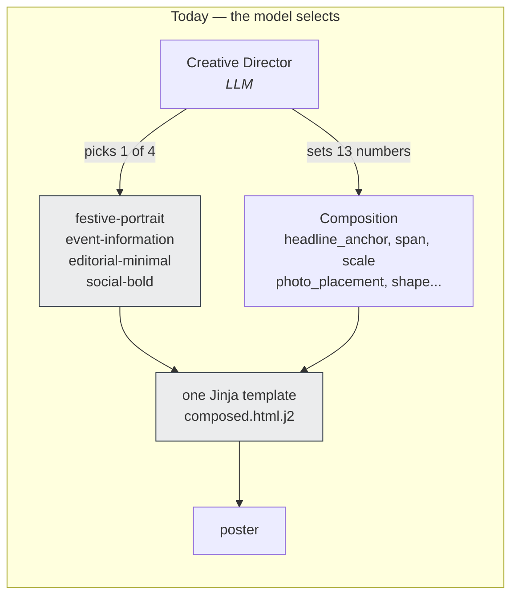
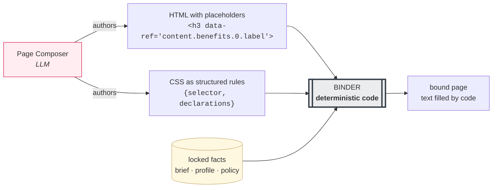
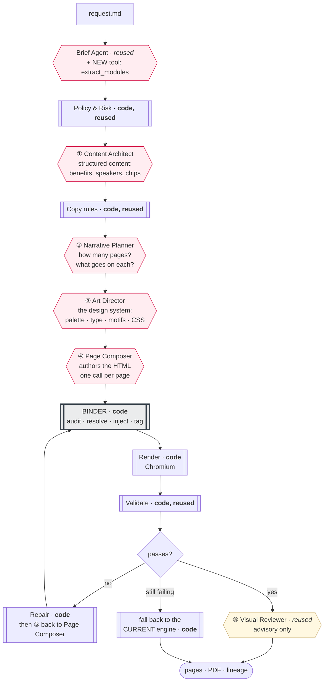
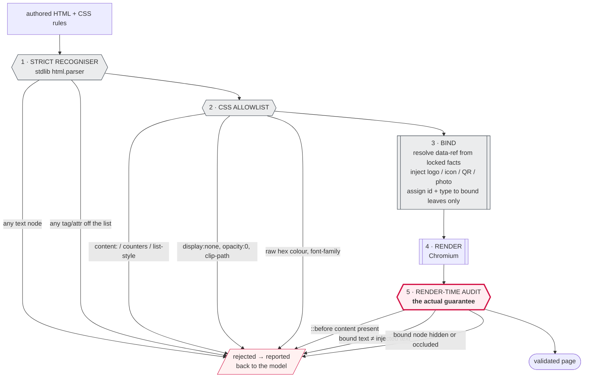
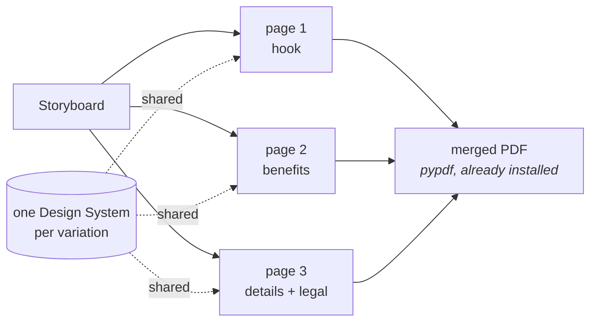
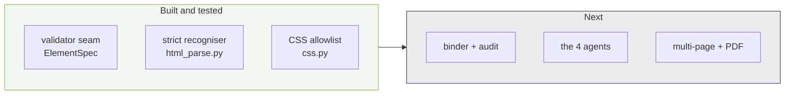
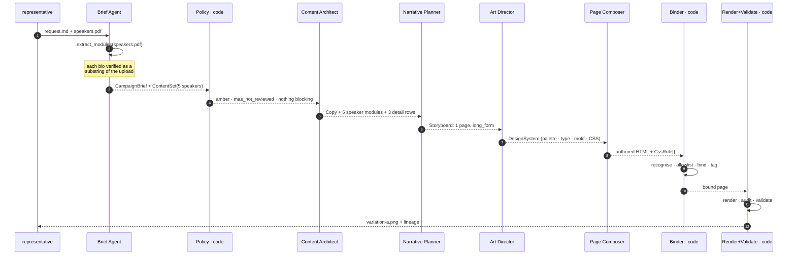

# The free-form design engine — what it is and how it works

**Status:** runs end to end · 437 tests passing · branch `freeform-engine`
**Companion:** `docs/architecture.md` is the master document for the engine that exists today.
This file explains the *second* engine being built alongside it.

---

## 1. The problem, in one picture

Today a model never designs anything. It *picks* from four layouts that people designed, and
nudges thirteen numbers. That is why every poster looks like a sibling of the last one.



`src/render/layouts.py` says it outright: *"Families are designed by people; an agent may only
choose one and fill its slots."*

The three reference brochures need things this grammar has no words for:

| Reference | Needs |
|---|---|
| Benefits brochure | **Repeating modules** — 4 × (icon badge + label + body), hairline dividers |
| AIA Career Seminar | **Content-driven length** — the page is long because there are 5 speakers |
| Platinum Legacy | **Full-bleed photo with text over it**, two rows of icon chips |

Confirmed in the contracts: `Copy` is five flat strings, so `content.benefits[2].label` has no
path at all; and `EventDetails.speakers` is a list of *bare strings* that the renderer never even
reads — so the speaker cards in reference 2 are literally impossible to express today.

---

## 2. What changes

The model writes real HTML and CSS. But it may not write a single character of **text**.



> **The model gets total authority over form, and zero authority over content.**

This is the whole idea. The binder rejects any markup containing text, then fills every
placeholder from the same locked-fact path the current engine uses. A model cannot state a wrong
date because it cannot write a date at all — which is a much stronger guarantee than today's
regex scan for invented facts.

---

## 3. Yes — this is agent-driven

Four new agents, two reused, one new tool. Every one goes through the existing `ModelGateway`,
so budgets, retries and usage accounting are unchanged (invariant 8).



| # | Agent | New? | What it decides | What it may **not** do |
|---|---|---|---|---|
| — | **Brief Agent** | reused, +1 tool | Understands the request. New `extract_modules` tool pulls speaker bios and product benefits **out of uploads**, verified as substrings of the source | Invent a bio or a benefit |
| ① | **Content Architect** | new | Shapes content into repeating modules — 4 benefits, 5 speaker cards, 8 chips | State a fact not in the brief |
| ② | **Narrative Planner** | new | 1 page or 3? What goes on each page? Replaces the Creative Director here | Decide page count alone — content volume and family constrain it |
| ③ | **Art Director** | new | The *look*: palette, type pairing, motif vocabulary, and the design-system CSS. One per variation, shared across its pages | Use a colour outside the brand tokens |
| ④ | **Page Composer** | new | Authors the page HTML. **The cost driver** — one call per page | Write any text, draw any icon, set any font |
| ⑤ | **Visual Reviewer** | reused, re-prompted | Critiques the rendered page; findings feed the repair loop | Block or approve — advisory only (ADR-006) |

Everything grey in the diagram stays deterministic code: policy, risk, disclaimers, copy rules,
logos, QR codes, Moving Mountains, validation, lineage.

---

## 4. How the binder keeps the guarantees

This is the part worth understanding, because it is what makes the freedom safe.



### Why there are five steps and not one

**The threat is not what you'd expect.** A model has little motive to invent a fact. It has a
strong motive to make an ugly mandatory legal line *disappear*. So step 5's occlusion probe
matters more than step 1's text rule.

Four specific traps, all now covered by tests:

| Trap | Why it bites |
|---|---|
| `&nbsp;` | Python's `str.isspace()` returns **`True`** for U+00A0. The obvious whitespace check lets an unlimited flood through |
| `&#48;&#46;&#51;&#53;&#37;` | Renders as "0.35%" but never reaches `handle_data` — needs its own guard |
| `` | Alt text **renders visibly** when an image fails to load |
| `::before { content: "..." }` | `innerText` does **not** see pseudo-element content, so a round-trip check cannot catch it |

That last one is why the guarantee has to be a render-time audit rather than a parser rule: the
parser can only block vectors someone thought of, while
`getComputedStyle(el, '::before').content` catches every CSS text-injection route at once.

### CSS is never parsed as text

The model sends `{selector, declarations}` objects and **we** serialise the stylesheet. So
`!important` is not "forbidden" — it is *unrepresentable*, because nothing in the serialiser can
write it. Same for `@import` and `@font-face`. And no CSS parser dependency is needed.

---

## 5. Multi-page



One design system is authored per variation and shared across its pages, so a 3-page brochure
reads as a set rather than three unrelated posters. Four output shapes are supported: richer
single poster, long-form (height grows with content — the 5-speaker case), carousel, and
multi-page PDF.

Pages live in a **subdirectory** (`pages/a/page-1.png`), never in the filename stem, because
`revise.py` parses variation ids out of stems and `variation-a-p2` would be misread as variation
`p2`.

---

## 6. What exists right now



| Phase | State | Evidence |
|---|---|---|
| **0 · Validator seam** | done | `src/validate/spec.py`. `dom.py` has zero `DesignDoc` references left; both engines share it. The 208 existing tests needed **no edits** |
| **1 · Recogniser + CSS** | done | `html_parse.py`, `css.py`, and **63 adversarial tests** — one per injection and hiding vector |
| **1 · Binder + audit** | done | `binder.py`, `renderer.py`. A hand-authored page binds, renders, audits and validates with **zero model calls** |
| **2 · The agents** | done | Content Architect, Narrative Planner, Art Director, Page Composer — all through `ModelGateway` |
| **3 · Pipeline + lineage** | done | `pipeline.py`, the `design` CLI command, page-level lineage, PDF merge |
| **4 · LangGraph** | done | `graph.py`, behind an optional `[graph]` extra; `run_sequential` runs the same nodes without it |
| **5 · Design patterns** | not started | `knowledge/design-patterns/*.yaml` — the biggest remaining lever on quality |

```bash
python -m src.main design --agent profiles/demo-agent --campaign campaigns/career-seminar \
    [--variations 4] [--no-graph] [--non-interactive] [--max-tokens 250000]
```

**437 tests pass, all offline.** The CLI is wired and exercised end to end with scripted
models; it has **not** yet been run against live Vertex models, so real-model output quality
is still unmeasured.

---

## 7. End to end: the 5-speaker seminar poster

A full trace of the case that is impossible today, using the demo profile. Reference brochure 2
is the target: two large speaker cards, then a 3-up grid, then icon detail rows — a page whose
*length is set by how many speakers there are.*



### Step 1 — what the representative writes

```markdown
# Campaign Request
AIA Career Seminar on 11 May, 6.30pm to 9pm at Marina Bay Sands Expo, Hibiscus Ballroom.
Five speakers — details in the attached PDF. Use my formal portrait.
Make it feel aspirational, not corporate. Give me 4 variations.
```

Plus `assets/speakers.pdf`, holding each speaker's name, role and a short bio.

### Step 2 — the upload becomes sourced facts, not prompt context

The Artifact Classifier marks it `information_source`. Then the Brief Agent's **new**
`extract_modules` tool proposes items, and *code* stamps and verifies each one:

```python
ContentItem(id="speaker-2", kind="speaker",
            label="Rachel Lim",                      # from the PDF
            role="Co-founder of Love, Bonito",       # from the PDF
            body="Rachel co-founded Love, Bonito at the age of 19...",
            source="artifact:speakers",              # ← required, no default
            verbatim=True, locked=True)
```

The verification is the same idea as `facts.invented` on the copy side: **each string must be a
normalised substring of the upload's extracted text.** A bio the model embellishes fails
`content.unsourced` and never reaches a page.

```
"Rachel co-founded Love, Bonito at the age of 19"   ✓ in source
"Rachel is Singapore's top entrepreneur"            ✗ rejected — not in source
```

This is the step that makes reference brochure 2 possible at all. Today
`EventDetails.speakers` is a list of bare strings the renderer never reads.

### Step 3 — policy decides, as it already does

Unchanged code. `family: seminar` starts at **amber**; `event.date` and `event.venue` are both
present so nothing blocks; `mas_not_reviewed` becomes a required disclaimer:

```json
{"risk": "amber",
 "required_disclaimers": ["mas_not_reviewed"],
 "disclaimer_texts": {"mas_not_reviewed": "This advertisement has not been reviewed by the Monetary Authority of Singapore."},
 "missing_blocking": []}
```

That disclaimer is now a **mandatory bound element**. The audit in step 8 is what stops the
design hiding it.

### Step 4 — content and copy

The Content Architect produces the repeating modules plus the flat `Copy`. The existing copy
rules run unchanged — `facts.invented`, prohibited terms, readability, `copy.cta_required`
(a seminar must have a CTA).

### Step 5 — the Narrative Planner chooses the shape

Five speaker cards at a readable size do not fit 1080×1350. It selects **`long_form`,
one page, height driven by content** — not a 3-page brochure, because this is one continuous
invitation rather than a sequence.

```json
{"pages": [{"index": 1, "purpose": "invite",
            "must_include": ["copy.headline", "brand.logo.red", "policy.disclaimer",
                             "content.speakers.0..4", "facts.event.date",
                             "facts.event.venue", "generated.qr"]}]}
```

The binder later enforces `must_include` — every required ref present exactly once.

### Step 6 — the Art Director sets the look

Four variations in **one call**, so the model differentiates them against each other rather than
converging. Each gets a distinct signature (ground · type pairing · motif · grid · image
treatment), enforced structurally the way `DirectionSet` works today.

Variation A picks the `ring` motif — reference brochure 2's decorative circle around each
portrait:

```python
CssRule(selector=".speaker-portrait",
        declarations={"width": "220px", "height": "220px", "border-radius": "50%",
                      "border": "3px solid var(--red)", "object-fit": "cover"})
CssRule(selector=".speaker-tag",
        declarations={"background": "var(--red)", "color": "var(--white)",
                      "border-radius": "999px", "padding": "6px 18px",
                      "text-transform": "uppercase"})
```

Note what is *not* there: no `font-family` (the binder assigns it), no hex colours (tokens only),
no `!important` (unrepresentable).

### Step 7 — the Page Composer authors the page

```html
<section class="speaker-row" data-group="speaker-2">
  
  <div class="speaker-copy">
    <span class="speaker-tag" data-ref="content.speakers.1.role"></span>
    <h3 data-ref="content.speakers.1.label"></h3>
    <p  data-ref="content.speakers.1.body"></p>
  </div>
</section>
```

Five of these, because there are five speakers. **The page is long because the content is long** —
which is exactly what a fixed template cannot do.

### Step 8 — the binder, in five moves

| Move | What happens here |
|---|---|
| 1 · Recognise | Tags and attributes checked. `<h3>Rachel Lim</h3>` would be rejected as `authored.text` |
| 2 · Allowlist | `.speaker-tag { background: var(--red) }` passes; `#BA0361` would fail `css.palette` |
| 3 · Bind | `content.speakers.1.label` → `"Rachel Lim"` from the **locked** ContentSet; `policy.disclaimer` → the MAS line; logo → the approved SVG; QR → generated from the verified registration URL |
| 4 · Tag | Only bound leaves get an `id` and a type. Wrappers keep `data-group`, so the measured set has no nested pairs and the collision rules work |
| 5 · Audit | After render: no `::before` content anywhere; every bound string matches what was injected; every bound node is visible and unoccluded |

Move 5 is what catches the realistic failure — a design that quietly drops the MAS disclaimer
behind a photograph:

```
contrast.text_pixels   'disclaimer' scores 2.1:1 against the image behind it
bind.occluded          'disclaimer' is covered by 'speaker-portrait-4'
```

### Step 9 — validate and repair

The rendered page goes through the same validators as today, now via `ElementSpec`:

```
layout.overflow        'speaker-4-bio' content 340x96 vs box 340x72
type.legal_prominence  'disclaimer' is 11px; the legal minimum is 15px
```

Repair is deterministic first — the shortfall is *measured*, not guessed, reusing the same maths
as the current engine, applied as an inline `style` (which wins on specificity, not just order):

```html
<p id="speaker-4-bio" style="font-size: 26px">   <!-- was 30px; 72/96 × 0.98 -->
```

Only if errors survive does the Page Composer get a second call, with its own HTML, the findings
and the rendered PNG. And if it still fails, the variation is rebuilt by the **current** engine —
free-form has no quality floor, so the existing engine is the floor.

### Step 10 — what lands on disk

```
output/career-seminar-may/
├── variation-a.png            the long-form poster
├── brief.json  copy.json  policy.json  usage.json
├── designs/variation-a.v1.json      authored HTML + CssRule[] + DesignSystem
└── campaign.json              lineage: every fact's source, every model call,
                               the audit result, the repairs applied
```

Every speaker bio on that poster traces back through `source: "artifact:speakers"` to a line in
the uploaded PDF. That is the property the whole design exists to protect.

---

## 8. Two things that need a decision from AIA

1. **AIA Everest Bold / Condensed are missing.** Only Regular and Medium exist, so the stacked
   ALL-CAPS display headline that gives all three reference brochures their punch cannot be
   rendered faithfully. This is the highest-leverage fix available and it is not a code change.
2. **There is no icon library.** Nine assets exist (6 product PNGs, 3 system SVGs); the
   references need 4–8 icon vocabularies each. `policy/brand-checklist.md` #7 says *"library
   icons only"*, so any open-licensed stopgap is explicitly **not brand-clearable** and must be
   flagged in lineage as such.

### A compliance gap found on the way

Checking reference brochure 3 against the live rules:

```
'Guaranteed floor protection'    -> green   prohibited: []
'0.35% p.a. bonus from year 11'  -> red     prohibited: []
```

"Guaranteed floor protection" is from a real AIA brochure and scores **green** — it matches none
of `guaranteed return` / `returns` / `payout` / `capital guaranteed`. A bare `guaranteed` stem is
missing from `risk_triggers.red` in `knowledge/campaign-rules/families.yaml`. Worth fixing on its
own, independently of this engine.
