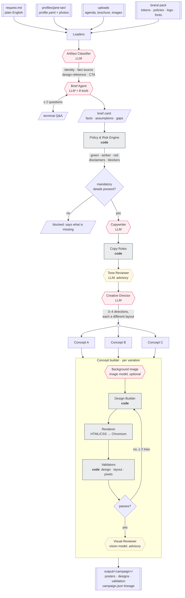
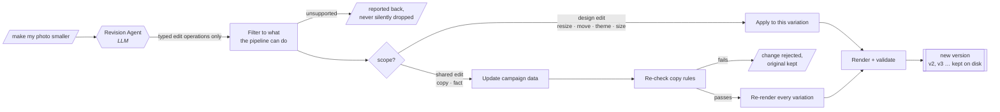

# AIA Agent Marketing Studio — what is built

**Status:** working V1 (folder-driven CLI) · 208 tests passing · 2026-09-20
**Full technical detail:** `docs/architecture.md` (master document). This file is the short version.
**Source documents:** `AIA_Agent_Marketing_Studio_Business_Requirements.md` (BRD) · `AIA_Standalone_Marketing_Generator_Architecture.md` · target architecture in `docs/architecture-plan.md`

---

## 1. In one line

A representative writes what they want in plain English; the Studio returns 3–4 brand-checked poster variations, and they can refine any of them by asking.

```bash
python -m src.main create --agent profiles/demo-agent --campaign campaigns/deepavali-2026
python -m src.main revise --campaign output/deepavali-2026 --variation 2 \
    --instruction "make my photo smaller and shorten the headline"
```

The governing principle, from both source documents:

> **AI for creativity and interpretation. Deterministic code for facts, logos, layout, QR codes and validation.**

---

## 2. The create workflow



Pink = generative · gold = advisory reviewer (flags, never approves) · grey = deterministic code.

## 3. The revise workflow



A text or layout edit costs **no image generation**. Changing a fact updates the campaign data, so every variation shows it.

---

## 4. What each part does

### Agents (4 real agents, LLM with tools or typed output)
| Agent | Input → output | Tier | Budget |
|---|---|---|---|
| **Brief Agent** | request + uploads + profile → `CampaignBrief` with story, sourced facts, assumptions | fast | ≤ 8 tool calls, ≤ 2 questions, ~20k tokens |
| **Copywriter** | brief + tone rules + real AIA voice examples → headline, sub, body, CTA, caption, alt text | quality | ~8k tokens |
| **Creative Director** | brief + copy + layout catalogue → 3–4 distinct directions | quality | ~10k tokens |
| **Revision Agent** | instruction + design → typed edit operations | fast | ~8k tokens, 0 images |

Plus the **Artifact Classifier** (what each upload is for) and the **Background Generator** (mood imagery only).

**Brief Agent tools:** read profile, list photos, read upload, resolve festival, resolve date, check URL, campaign rules, ask the user.

### Advisory reviewers (flag, never approve)
**Tone Reviewer** (mentor voice, 5 tone principles) and **Visual Reviewer** (vision model: balance, crop, legibility, authentic imagery). Their findings can never be errors.

### Deterministic services (where the guarantees live)
Loaders · Policy & Risk Engine · Design Builder · Renderer (HTML/CSS → Chromium) · Moving Mountains SVG · QR codes · Validators · Budget Guard · Lineage Writer.

---

## 5. Guardrails that are structural, not prompted

| Guarantee | How it is enforced |
|---|---|
| **A model can never state a fact** | Factual elements (dates, contacts, QR, disclaimers, logo, photo) may only hold a *reference*. The contract rejects inline text. |
| **Copy cannot invent facts** | Any date, time, price, percentage, phone number or URL in generated copy must already exist in the brief. |
| **Verified data wins** | Profile contact details beat anything a model supplies; typed event fields beat loose ones (a model once mis-transcribed a URL — the typed field held). |
| **Risk can only go up** | The policy engine decides green/amber/red from YAML rules; an agent may raise it, never lower it. |
| **Logos are sourced assets** | Placed from the approved SVG, red or white only; never generated. |
| **Variations are genuinely different** | Each must use a different layout family and differ in red treatment, photo mode or mountains variant. |
| **The face is never generated** | Portraits are only cropped, cut out and colour-balanced. |
| **Uploads are data** | Instruction-like text inside a document is flagged and ignored. |
| **Spend is bounded** | Per-call caps, per-run budget, graceful partial results, usage recorded per node. |

---

## 6. Validation: 120+ checks per poster

| Layer | Examples |
|---|---|
| **Design data** | logo present, red or white, approved position; one Moving Mountains graphic, 3–4 peaks, no rotation, inverted only on red; ≤ 4 secondary colours; known style tokens |
| **Rendered page** | text overflow, elements outside the canvas, safe margins, ≥ 15px type, headline ÷ 3 ÷ 2 hierarchy, approved typefaces, WCAG contrast, logo clear space, **text–image collision** |
| **Pixels** | AIA Red dominant in the coloured area (photographs masked out, since the rule is about design colour) |
| **Copy** | invented facts, prohibited phrases, unsourced claims, jargon, fear wording, acronyms, "Purpose"/"Healthier, Longer, Better Lives" capitalisation, readability, CTA present |
| **Advisory** | tone against the mentor traits; a vision model on the rendered poster |

Every rule traces to a line in `brand/aia-singapore/policy/` or `knowledge/campaign-rules/`.

---

## 7. The knowledge it runs on

| Source | What we extracted |
|---|---|
| **AIA Brand Standards v2.0** (141-page PDF) | Colour with Pantone/CMYK/tints, logo clear space and minimum sizes, Moving Mountains construction and tint tables, type hierarchy ratios, mentor persona, 5 tone principles, Singapore = "Emancipation" cluster, photography do's and don'ts, the official brand checklist |
| **design.aia.com** (12 pages) | Digital palette, writing systems, readability, inclusivity, grid and 4px spacing |
| **aia.com.sg** (608 pages crawled) | **161 disclaimer clauses** in 14 categories (MAS, PPF/SDIC, underwriting, switching, suitability), 608 pages of real AIA voice used as copy examples, 1,464 reference images |
| **Downloaded assets** | Corporate Logo SVG (red + white), AIA Everest Regular + Medium, Noto Sans SC/TC/Tamil, Open Sans, product icons |

---

## 8. What a campaign produces

```
output/deepavali-2026/
├── campaign.json        lineage: request hash, profile version, uploads, brand pack 0.2,
│                        compliance pack 0.1, models, token usage, findings, hashed exports
├── brief.json           facts with sources, assumptions, story layer
├── policy.json          risk, required disclaimers, blockers
├── copy.json            approved wording
├── usage.json           every model call, tokens by node
├── variation-a.png      the poster (provenance embedded in the file itself)
├── variation-a.html     the layout that produced it
├── variation-a.geometry.json
├── concepts/            the creative direction chosen
├── designs/             design documents, versioned v1, v2 …
└── validation/          every check and finding
```

---

## 9. Numbers from a real run

- **3–4 variations** per campaign, each passing 121 checks
- **~12k–33k tokens** per campaign; a text revision is under 10k and costs no image
- **Rendering**: about 1.5 s per poster; PNG, JPEG and PDF from one engine
- **200 tests**, including validators fired by deliberately broken designs, and every agent runnable with no network

---

## 10. What is not built yet

**Needs AIA, not code:** HLBL logo lockup, AIA Everest Bold/Condensed, the official Moving Mountains vector library, the icon library, real agent portraits, and Compliance sign-off on the disclaimer rules and the red-dominance decision.

**Phase 2 by design:** approved-source retrieval for product claims, the compliance reviewer, human approval for red-risk material, translations (Chinese/Malay/Tamil), and the admin UI.

**Deferred deliberately:** LangGraph orchestration, which the plan introduces only when approvals and resumability arrive. The contracts are already shaped for it.

**Open decision:** the Brand Standards say AIA Red must dominate; the newer Qi digital system caps red at 20%. We follow the Brand Standards for marketing collateral, and this needs confirming with AIA Singapore Marketing.
